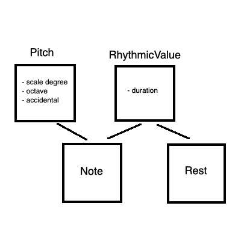
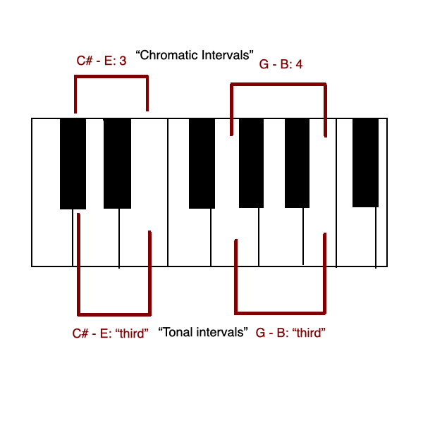
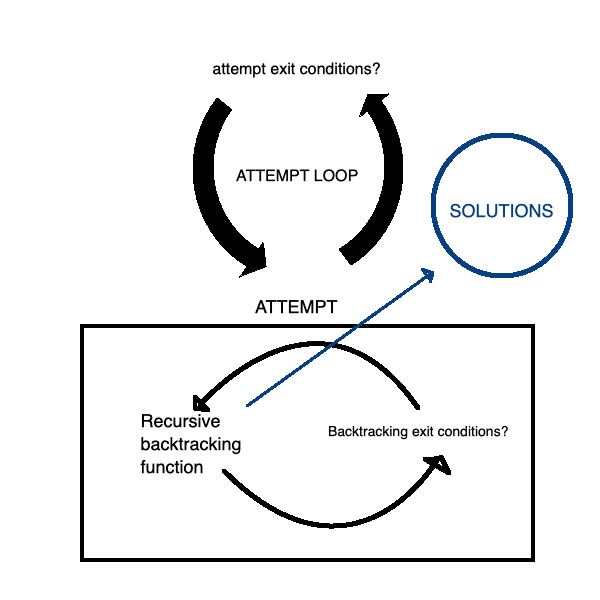

# Counterpoint Generator (in Progress)

Temporary gallery of results can be accessed [here.](https://zalmankelber.github.io/Counterpoint/)   

Earliest draft of this project (including original README) can be found [here.](https://github.com/ZalmanKelber/Counterpoint/tree/main/archive/github_audio)

## Basic Description 

**Tl;dr:** This program uses a backtracking algorithm to compose short musical compositions in the very particular and complex style of 16th century vocal polyphony

----

The sacred vocal music of late Renaissance Italy, which reached its apex with the works of [Giovanni Pierluigi da Palestrina](https://en.wikipedia.org/wiki/Giovanni_Pierluigi_da_Palestrina), is unparalleled in history for its unique combination of complexity and extreme strictness of style.  It led to a pedagogical system known as [Species Counterpoint](https://en.wikipedia.org/wiki/Counterpoint), that involves a succession of increasingly difficult and complicated compositional exercises that has, in the centuries since, been foundational to Western musical education.

The project uses backtracking algorithms and pseudo-random number generators to produce unique examples of Counterpoint exercises and Palestrina-style compositions based on various inputs.  To date, a draft of this project has [successfully composed](https://zalmankelber.github.io/Counterpoint/) short pieces in two-voice, imitative polyphony.  A frontend UI will allow users to select various compositional parameters (including length, vocal range and church mode) to feed into the algorithm.  Eventually, a more complex UI will allow users to create their own examples, evaluate their "legality," and turn their partial results into finished examples

## App design 

### Musical Notation System 

[These files](https://github.com/ZalmanKelber/Counterpoint/tree/main/notation_system) show the musical system developed for this project.  A Pitch class and a RhythmicValue class are inherited by Notes and Rests.  An individual line of Counterpoint is therefore represented as a list of objects of subclasses of the RhythmicValue class, as can be seen in the inheritence diagram below.

Pitches (and thus Notes) are represented as a combination of scale degrees, octaves and accidentals.  This makes it convenient for the class methods to compare two pitches and determine both the "tonal" interval as well as the "chromatic" interval between them, both represented as integers, as shown in the diagram below.

A ModeResolver object (of which every CounterpointGenerator will contain an instance variable) retrieves import information about pitches based on the [church mode](https://en.wikipedia.org/wiki/Mode_(music)) each exercise is written in, including which accidentals for pitches to consider default, which pitches are available for use, and which pitches should occur at the beginning and end of a melody, &c.

### CounterpointGenerator 

All exercises and compositions are produced by subclasses of the CounterpointGenerator class, which uses backtracking algorithms to find solutions to the Species Counterpoint problems.  It's necessary to note that, for the most complicated problems, a backtracking algorithm will be untenably long.  Therefore, it is of critical importance that  

* the backtracking algorithm must stop before it's complete depending on certain conditions, and 

* not all backtracking algorithms will succeed in finding solutions before they're stopped.

A long-term goal of the project is to rework it using a local search algorithm.  But for the meantime, the following loops run for each CounterpointGenerator instance:

Each attempt calls an `_initalize` function that uses pseudo-random number generators to come up with arbitrary conditions for the attempt.  In all subclasses, these include, for example, the highest and lowest notes (and thus the available pitches in between) as well as the measures by which the highest and lowest notes must appear by.  

The backtracking algorithm then selects all possible pitches and rhythms for a given exercise and runs them through a series of filters in order to determine whether or not they can "legally" placed on the Counterpoint stack.  For the one-part examples, pitches are filtered through the melodic insertion checks.  For each surviving pitch, rhythmic values are then filtered through the melodic rhythmic filters to determine which combinations of notes and rhythms can be added to the exercise at the given location (based on the adjacent notes that have already been added).  In two-part and multi-part examples, each pitch is also subject to harmonic insertion checks, as well as harmonic rhythmic filters.  Thus far, in the most complicated examples, each potential note must survive around fifty or so filters before it is deemed adequate to be added to the stack.

When the backtracking algorithm reaches the end, a potential solution must undergo final checks in some subclasses before it can be added to the `_solutions` object.  Once the attempt loop ends, solutions are sorted according to a scoring function, and the best solution is returned with the `_get_one_solution` function.

### Web Application 

At this stage of the project, the goal is to create a simple frontend UI that allows users to select simple inputs to send to a backend API endpoint.  The backend will then generate an example and send the resulting optimal solution (which will be in the form `list[list[RhythmicValue]]`) to the MidiWriter class, where it will first be converted into a MIDI file and then into a browser-supported .wav file using FluidSynth and sent back to the user.

